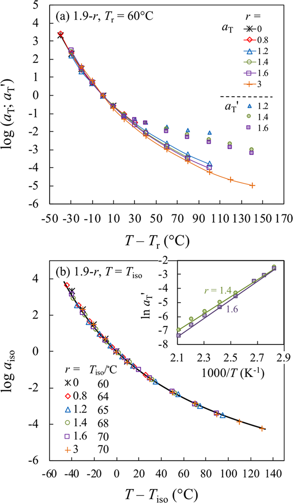

# Relationship between Reaction Kinetics and Chain Dynamics of Vitrimers Based on Dioxaborolane Metathesis

## 概要

- ジオキサボロランメタセシス反応を利用したビトリマーの反応速度と鎖ダイナミクスの関係を分析。
- 架橋剤の含有量の増加に従い、線形粘弾性においてゾル・ゲル転移プロセスと逆ゲル・ゾルプロセスが観察。
- 架橋密度の温度依存性（高温でのプラトーからのフロー挙動）がネットワークストランドのラウス緩和時間よりも大きい場合に、ストランド緩和がジオキサボロランメタセシス反応の低い活性化エネルギーによって制御されることを示した。

{width=50%}

## 実験項について（Section 2.1, ページ 2-3）

### 材料の調達と合成

- Poly(hexyl methacrylate-random-2,3-dioxaborolanepropyl methacrylate)を、RAFT重合により合成。
  - RAFT剤には2-シアノプロペン-2-イル-ジチアベンゾエートを使用
  - 分子量測定にはゲル浸透クロマトグラフィー（GPC）と光散乱・屈折率検出器。

- Mnは約10,000で、設計した平均官能基数pNは約60。
  - 主要な官能基の含有量（ボロン含有率$\phi_p^B$）を元素分析で測定。
  - ボロンの元素含有量から、各分子鎖あたりのボロン含有官能基数pNを推定。

Table 1. Important Parameters of all Precursor Samples
| samples pN-r | N   | Mn (kDa) | Mw/Mn | $\phi_p^B$ (ppm) | Tg (°C) |
| :----------: | :--: | :--: | :--: | :--: | :--: |
| 0.7−0        | 60  | 10       | 1.15  | 670       | −6      |
| 1.9−0        | 60  | 10       | 1.2   | 1800      | −1      |
| 3.1−0        | 59  | 9.7      | 1.3   | 2700      | 9       |

- ランダム共重合を仮定して、ポリマー鎖一本あたりの側鎖架橋点の存在確率$P(f)$を下式で算出
  - $P(f;p,N)=\dfrac{N!}{(N-f)!f!}p^f(1-p)^{N-f}$

{width=50%}
Figure 2. Binomial distribution function P( f) of polymer chains having f functional sites. The average number of functional monomer(s) pN = Σf P(f) are indicated in arrow.

- 架橋剤の使用とサンプル準備：
  - 二官能性の架橋剤（2,2′-(1,4-Phenylen)-bis[4-methyl-1,3,2-dioxaborolane]）を用いて、官能基間の交差リンクを形成
  - rはペンダント官能基と二官能架橋分子とのモル比
  - サンプルの evaporation（揮発）を確認するため、反応後のボロンの重さ比率（$\phi_{pro}^B$）を測定し、反応前の理論値（$\phi_{rea}^B$）と比較。

- レオロジー測定（ページ 3）

  - 高純度窒素環境下で、ストレス制御型レオメーター（Anton Paar MCR-302）を用いて、弾性率（G′）と損失弾性率（G″）の測定。
    - 測定範囲：周波数範囲10^2から10^(-2) rad/sec。温度範囲は10°Cから200°C。
    - 各温度での測定は、10°Cまたは20°Cのステップで行い、最低温と最高温での再現性確認。

  - 時間−温度過渡（tTs）の作成と解析方法：

    - 60°Cを基準温度（T_r）として設定し、各温度のデータを規格化・シフトし、マスターカーブを作成。

    - 高周波側の弾性成分を時間−温度スケールにより重ね合わせ、弾性挙動の温度依存性評価。

### 反応動態とモデルの検討（ページ 3-4）

- 二段階反応の平衡定数（K_1, K_2）や反応性を、化学平衡式に基づいて解析。

  - $K_1[P][C]=[PC][B]$
  - $K_2[P][PC]=[P_2C][B]$
- このとき、以下の濃度の相関関係がある。
  - $[P]+[PC]+2[P_2C]=C$ ただし $C$は反応前のペンダント官能基濃度
  - $[P]+[B]=C$ 
  - $[C]+[PC] +[P_2C]=(r/pN)\times C$ 

{width=50%}
Figure 1. (a) Chemical structures of precursor and cross-linker, (b)first and (c) second step of the dioxaborolane metathesis reaction, with K1 and K2 as the reaction equilibrium constants, respectively. The products in the first and second reactions are PC and P2C, respectively, and the byproduct is B.

- 上述の関係をプロットすると、Figure 3, 4.の関係となる。
  - r$\simeq$1程度までは架橋ポリマーの量が増加
  - rがある程度大きくなると架橋ポリマーのコンテントは減少

{width=50%}
Figure 3. Model prediction of [P2C]/C against r for the 1.9-r system, with given reaction constants K1 = 1 and K2 as indicated.

## 実験結果（Section 4, ページ 4-7）

### ガラス転移温度について

- r（クロスリンクの割合や交差点の数に相当）を変化させた系について、
  - T_gはrが**小さい範囲（r ≤ 1.6）では増加し
  - rが大きくなる（r ≥ 3）**と減少
- 説明
  - これは、rが小さいときは交差点の数が増え、分子運動が制限されてT_gが上昇
  - 一方、rが大きくなる（$r>3$）と架橋点の数密度が減少しT_gが低下

{width=50%}
Figure 5. DSC traces of 1.9-r samples with the value of r as indicated. Inset plots Tg against r.

### 線形粘弾性の測定結果について

#### Figure 6: 1.9-r vitrimer(r=0 to 3.0)のTime−Temperature Superposition, tTs

- ここでは、簡易的に1つのマスターカーブ（$60^o$C基準）を作成
  - r=0ではほぼ終端緩和の挙動
  - r=0.8においても冪に従っているので、終端緩和の前のゾルの挙動
  - r>1.2ではラバープラトーを示し、r=1.6まで増加。
  - r=1.2でシフトがうまく行っていない

{width=50%}
Figure 6. Comparison of pseudo-master curves of the storage and loss moduli, G′ and G″, reduced at Tr = 60 °C for the precursor and 1.9-r vitrimer samples with r from 0 to 3.0.

#### Figure 7: 1.9-r vitrimer(r>3.0)のTime−Temperature Superposition, tTs

- 架橋点の数密度の低下と思われるゲルーゾル転移

{width=50%}
Figure 7. Comparison of pseudo-master curves of the storage and loss moduli, G′ and G″, reduced at Tr = 60 °C for the 1.9-r vitrimer samples with r from 3.0 to 12.

#### fig 8: tTsについて

- 参照温度は60度
- この評価においては、まず縦シフトを行った後に横シフトを行っている。←妥当性は疑わしい。

具体的には、

- Figure 8aは、サンプル1.9−0.8についての結果
  - 温度上昇に伴い、terminal relaxationが低周波側へシフト

- Figure 8bは、サンプル1.9−1.2における結果
  - 温度の増加により、低周波側の弾性挙動の広がりやplateau（プラトー）部分の拡大が観察
  - 架橋点が増加したかのような振る舞い

- Figure 8cは、より高いゲル化度を持つサンプル1.9−1.4の結果
  - 温度の上昇によるプラトー部分の広がりはやや顕著ではない

{width=50%}

Figure 8. Test of tTs of the 1.9−0.8, 1.9−1.2, and 1.9−1.4 samples. The storage and loss moduli G′ and G″ are normalized by a temperature factor bT = Tr/T, and shifted by a factor aT to superpose the high-ω Rouse part of modulus.

#### Figure 9について

- 参照温度を80°Cとした重ね合わせを実施
  - 脱架橋プロセスが支配的になる高温で得られたデータに注目
  - 低周波側の挙動に注目してシフト

- G′およびG″のデータは
  - 低ωでは適切に重ね合わせ可能
  - 高ωでは困難
  - これは、温度上昇に伴うプラトー領域の広がりを反映

{width=50%}
Figure 9. Test of tTs of the 1.9−1.2 and 1.9−1.4 samples. Normalized storage and loss moduli, bTG′ and bTG″, obtained at T > 80 °C are shifted by a factor aT′ to superpose the low-ω part of moduli to that at T = 80 °C, at which aT′ (in Figure 9) equals to aT (in Figure 8).

#### fig 10.について

- (a)の白抜きは参照温度は60度での高周波数側に従ったもの
  - その若干のズレは(b)に示したようにTgからの温度シフトを一定として整理し直すときれいに揃った
- (a)の塗りつぶしの記号は、低周波（低ω）側の脱架橋領域（図9および図S9b）を重ね合わせることで得られたシフト因子aT′を示す。
  - aT′の温度依存性は、aTに比べてはるかに弱く
  - WLF型のaTとは対照的に、Arrhenius型の温度依存性
- (b)の挿入図にあるln aT′対1000/Tのプロットへの線形フィッティングから
  - 活性化エネルギーEaは、1.9−1.4では50 kJ/mol
  - 1.9−1.6では55 kJ/mol
  
{width=50%}
Figure 10. (a) LVE shift factor aT in Figures 6 and 8, as represented by unfilled symbols connected in curve, and aT′ in Figures 9 and S9b, as represented by filled symbols, plotted against T − Tr for the 1.9-r system, with r (≤3) values as indicated. (b) aT in the top panel is reevaluated with respected to the new reference temperature Tiso = Tg \+ 61 °C (Tiso = Tr for r = 0). The curve represents a prediction of WLF eq 8. Inset shows plots of ln aT′ against 1000/T for the 1.9−1.4 and 1.9−1.6 samples.

## Discussionについて
ChatGPTでの要約は以下となる。

- ビトリマーの脱架橋挙動は、小分子の拡散性に依存するため、温度依存性が弱い。
- 物理ネットワーク（アイオノマーなど）では、分節運動に支配されるため、温度依存性が強い。
- この差は、化学的架橋と物理的相互作用の性質の違い（拡散性・再結合・方向性）に由来します。

彼らの主張
- 今回の結果は、イオン基や水素結合に基づく物理ネットワークで以前に観察された傾向とは正反対
  - 脱架橋に由来する弾性率の温度依存性が、Rouse成分に比べて弱いこと
  - そしてそれに伴って温度上昇によりプラトー領域が広がる
  - 物理ネットワークでは、温度が上がるとプラトー領域が狭くなることが知られています（文献3, 54, 55参照）。
- 高温域では脱架橋領域の温度依存性に顕著な差があり、アイオノマーとビトリマーでは、前駆体より強いまたは弱い温度依存性を示す

<!--  -->

{width=50%}

Figure 12. (a) Comparison of the temperature dependences of shift factors aT of vitrimer, ionomer, and their precursor. The curve shown in the blue region is the shift factor of Rouse part of segment, which is the same for all three systems if we ignore a difference of Tg. The curves shown in the red region are the shift factors of the decrosslinking part of modulus of vitrimer and ionomer, which are different from that of the precursor. (b) Schematic illustration of the decrosslinking reaction where a small molecular byproduct attacks the cross-linking site.
